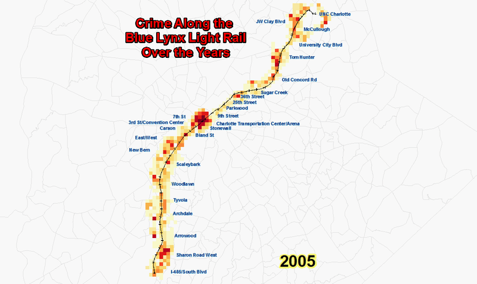
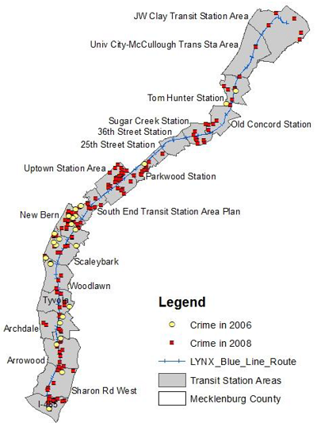

# Light Rail Opening’s Impact On Crime in Charlotte, NC
A comparative study on different Crime Types along the Charlotte Blue Lynx Light Rail before and after the inception of the service.
All visualizations done using Esri's ArcGIS product - ArcMap v10.6.1.

Below is a visualization of the yearly total crimes from 2005 and 2016. A fishnet of area __1000ft x 1000ft__ was created.

* Our Study finds that drug related violations have increased after the inaguration of the light rail.

__Transit Station Areas__ obtained from Charlotte Government Data Source : http://data.charlottenc.gov/datasets/transit-station-areas